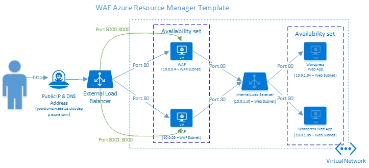
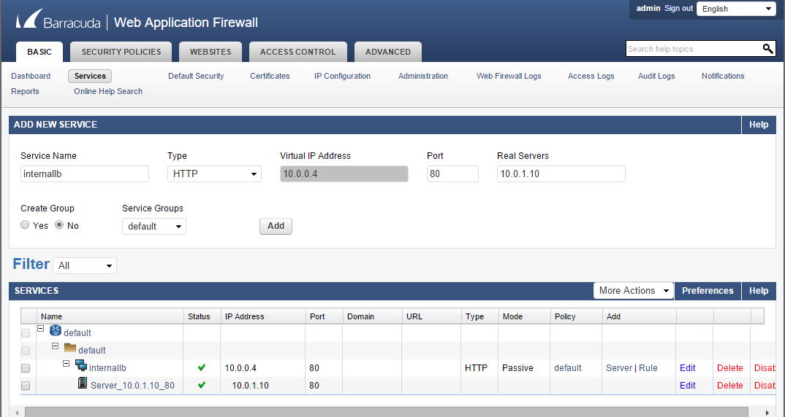
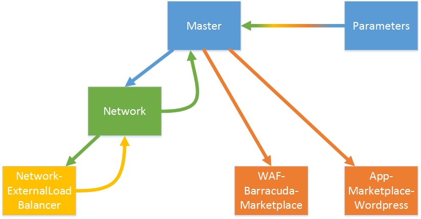

# Deploy a Load Balanced WAF

This ARM solution is all you need to deploy a load balanced Barracuda Web Application Firewall (WAF) into an Azure VNet and have it
proxy traffic to an application in the same VNet. 

Spend 10 minutes understanding the solution and reviewing the parameters (you will have to change a few them). 
This solution is a great introduction to advanced ARM templates and will demonstrate how easy it is to protect your web app with WAF.

The ARM templates in this solution are separated into function. The templates are "nested"
so that there is a hierarchical relationship between them. They follow a single responsibility model. This is done to make it easier to swap
templates in the future and to keep each template a manageable length.

## The Solution

### Solution Description

* Builds a VNet in Azure to host the WAF and the Application. The VNet has 2 subnets: A WAF subnet for the WAF 
nodes and a Web subnet for the Web app.
* Creates a Public IP address and DNS Endpoint to reach the application.
* Creates an External Load Balancer that points to the WAF VMs.
* The External Load Balancer has NAT rules so that each WAF node can be reached individually and configured. 
The External load balancer NAT configuration is dependent on the number of WAF nodes, so the 
External Load Balancer has been separated into its own Template.
* Creates an Internal Load Balancer that will point to the web application.
* Adds a storage account to host the WAF and App VM disks.
* Creates the Barracuda WAFs with the Hourly licensing model from the Azure Marketplace.
* Creates the Wordpress VMs from the Azure Marketplace.

### Solution Outline

### Current Limitations

* The solution does not configure the WAFs. See the Configure WAFs section.
* The solution deployees all resources into the resource group's region. You won't be asked to specify this.
* The solution cannot use an existing VNet.
* The solution cannot use an existing storage account.
* There are no diagnostics turned on for the deployed solution.
* The parameters are set for port 80 but can be modified for 443.
* The solution is configured for 2 WAF nodes. To add more nodes, you'll need to update the parameters and 
the External Load Balancer template since the NAT addresses are tightly coupled to the number of nodes that
 need to be independently managed.

### Configuring the WAFs:

* Go to the admin screen of the WAF by visiting the app's URL, appended with the NAT rule's port number.
* For example, if you chose DNS name "myapp" and your app was deployed to the East US data center, your URLs 
for managing the WAFs would be
http://myapp.eastus.cloudapp.azure.com:8000 and http://myapp.eastus.cloudapp.azure.com:8000
* In the Barracuda admin console, choose "Service" in the top menu and create a new service. Create a simple HTTP service that points to 10.0.1.10, the internal load balancer. See the image below.

## The Templates

### Template Call Pattern

1. The Master template is called with the Parameters File.
2. The Master template calls the Network template.
3. The Network template calls the External Load Balancer template.
4. The Network template passes output parameters back to Master template.
5. The WAF and App templates are called in parallel.

### The Paramaters

Many of the templates in the solution have parameters with default values. You should be able to safely use these
default values. There are some parameters that need to be defined. They are defined in the Parameters file that get deployed with the master template.
Many of the values defined in the Parameters file can be left alone. Some must be changed.

#### parameter: networkTemplate

The location of the Network Template. All the templates need be accessible from a public URL (you can't point to a file on your local disk).

#### parameter: wafTemplate

The location of the WAF Template.

#### parameter: appTemplate

The location of the App Template. The Parameter file points to the Wordpress marketplace template. There's anothe template in the solution that 
builds an application from a local image. You can use this as guidance for deploying your own image-based application.

#### parameter: externalLoadBalancerTemplate

The location of the External Load Balancer Template. The External Load Balancer has the NAT Rules so that you can configure the Barracuda WAFs individually. Were you to add more WAF nodes, you
would need to update the External Load Balancer template to include more NAT rules so you can reach the additional nodes.

#### parameter: adminUsername

The admin username for logging into both WAF and App VMs.

#### parameter: nadminPassword

The admin password for logging into both WAF and App VMs. 

#### parameter: globalPrefix

This prefix will be applied to all resources created in this solution. This will help you easily identify all the components when browsing the solution in the Azure Portal.

#### parameter: vnetName

The name of your VNet (Note the global prefix will be prepended to this name).

#### parameter: dnsNameForApplication

The DNS prefix for your site. It has to be unique. This will be a part of the public URL for accessing your application. You could of course apply a custom domain name later.

#### parameter: storageName

The name of the storage account that gets created for holding your VM disks. It has to be unique.

#### parameter: imagePublisher

The name of the WAF Publisher (leave as *barracudanetworks* to use the Barracuda WAF).

#### parameter: imageOffer

The offer from the publisher.\ (leave as *waf* to use the Barracuda WAF).

#### parameter: imageSKU

The SKU of the Publisher's offer that you want to use. The Parameter File uses the *hourly* SKU. If you've got Barracuda licenses that you can apply, change this to *byol* (bring your own license).

#### parameter: wafVmSize

The VM size for your WAF VMs.

#### parameter: appVmSize

The VM size for your App VMs.

#### parameter: backendPortNumber

The port number your application listens on. Wordpress listens on port 80. Apps with SSL listen on port 443. Some apps require other ports. NodeJS apps sometimes listen on port 3000.

#### parameter: frontendPortNumber

The port number requests to the app come in on. Usually this is port 80 or port 443 from a browser.

#### parameter: manageWafPortNumber

The port number that the WAF admin console listens on (leave this as port 8000 for Barracuda WAF). Note that the NAT rules in the External Load Balancer will forward external ports to this port in the NAT rules. The external ports can be any allowable ports. 
